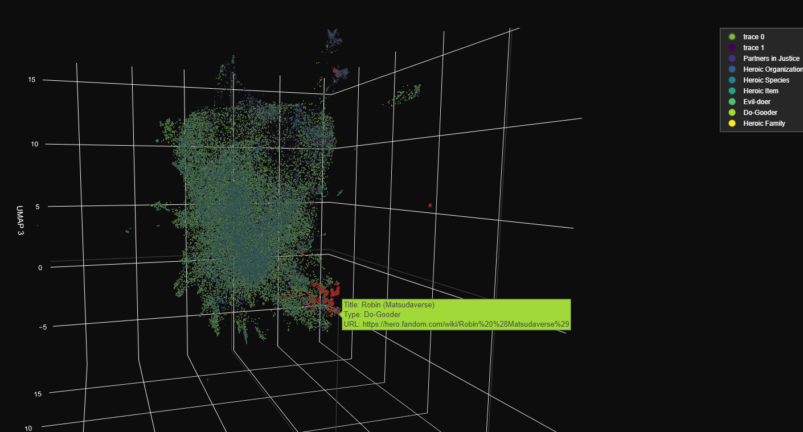

# Hero Character Embedding Project

## Overview

This project aims to create a system for visualizing relationships between fictional hero characters from various franchises. By leveraging natural language processing (NLP) techniques and machine learning, I've developed a fun tool that can generate embeddings for hero characters, allowing for exploration and comparison of these characters based on their descriptions and attributes extracted from the hero wiki https://hero.fandom.com/.

This project is basically "wiki agnostic" and can be used for any other fandom wiki by changing the web scraping part.

## Visualization Example



This image showcases a 3D visualization of hero character embeddings, demonstrating how different characters cluster based on their attributes and descriptions. In red are the points that correspond to the query "Batman". They are surrounded by other points that are similar, such as "Bruce Wayne" and "Robin". Many of DC and Marvel characters are in the same cluster, which makes sense given their similarities.

## Features

- Web scraping of hero character data
- BERT model fine-tuning for domain-specific embeddings
- Embedding generation for hero characters
- 3D visualization of character embeddings
- Interactive search functionality

## Project Structure

```
.
├── data/
│   ├── all_pages.jsonl
│   ├── characters.jsonl
│   ├── finetuning_data.json
│   └── hero_embeddings.json
├── src/
│   ├── web_scraping.py
│   ├── finetuning.py
│   ├── embeddings.py
│   └── visualization.py
├── hero_bert_model/
├── requirements.txt
└── README.md
```

## Installation

1. Clone the repository:

2. Create a conda environment and activate it. My environment.yml is full of unnecessary packages, but I don't want to clean it up. Use under your own discretion.

   ```
   conda env create -f environment.yml
   conda activate hero-character-embedding
   ```

## Usage

The scripts take a long time to run, so I recommend just using the final html file.

1. Web Scraping:

   ```
   python src/web_scraping.py
   ```

2. Fine-tuning BERT:

   ```
   python src/finetuning.py
   ```

3. Generating Embeddings:

   ```
   python src/embeddings.py
   ```

4. Visualizing Embeddings:

   ```
   python src/visualization.py
   ```

## Visualization

The visualization script generates an interactive 3D scatter plot of hero character embeddings. You can explore the plot by:

- Rotating and zooming the 3D space
- Hovering over points to see character details
- Using the search functionality to highlight specific characters

The resulting HTML file will be saved as `3d_hero_embeddings_visualization_js.html`.

## Technologies Used

- Python
- BeautifulSoup for web scraping
- PyTorch and Hugging Face Transformers for model fine-tuning and embedding generation
- UMAP for dimensionality reduction
- Plotly for interactive 3D visualization

## Future Improvements

- Expand the dataset to include more characters and franchises
- Implement more advanced visualization techniques
- Add a user interface for easy uploading and comparison of custom character descriptions
- Explore multi-modal embeddings by incorporating character images

## Contributing

Contributions are welcome! Please feel free to submit a Pull Request.
